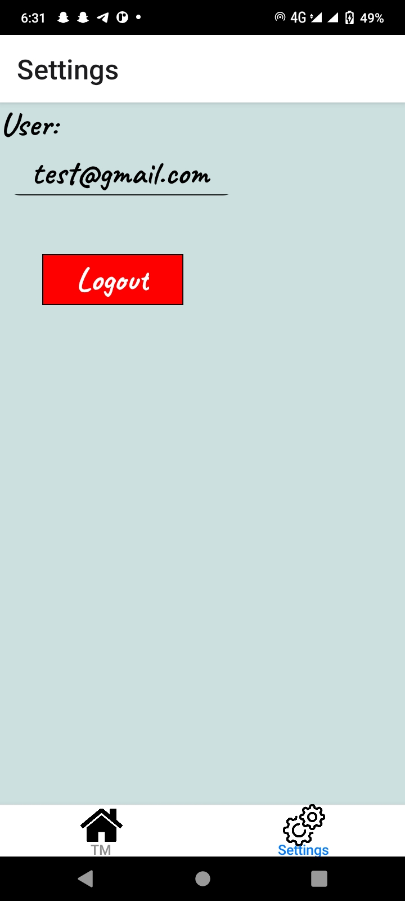

This is a new [**React Native**](https://reactnative.dev) project, bootstrapped using [`@react-native-community/cli`](https://github.com/react-native-community/cli).

# Getting Started

> **Note**: Make sure you have completed the [Set Up Your Environment](https://reactnative.dev/docs/set-up-your-environment) guide before proceeding.

## Step 1: Start Metro

First, you will need to run **Metro**, the JavaScript build tool for React Native.

To start the Metro dev server, run the following command from the root of your React Native project:

```sh
# Using npm
npm start

# OR using Yarn
yarn start
```

## Step 2: Build and run your app

With Metro running, open a new terminal window/pane from the root of your React Native project, and use one of the following commands to build and run your Android or iOS app:

### Android

```sh
#npx
npx react-native run-android

# Using npm
npm run android

# OR using Yarn
yarn android
```


If everything is set up correctly, you should see your new app running in the Android Emulator, iOS Simulator, or your connected device.


## Congratulations! :tada:

You've successfully run and modified your React Native App. :partying_face:

📝 React Native Task Manager App

This is a simple task manager mobile app built using **React Native CLI** for learning and practice purposes.

## Features

- App Icon
- Splash screen 
- Login screen with hardcoded credentials
- Bottom tab navigation with two screens:
  - Tasks: Add, delete, and mark tasks complete/incomplete
  - Settings: Show user email and allow logout
- Task data saved in AsyncStorage
- Task state managed using `useReducer` and React Hooks
- Icons used in bottom tab from custom assets

🔐 Login Credentials

--Please Use--
Email - test@gmail.com
password- 123456

src/
├── assets/
│ └── icons/
│ ├── home.png
│ └── settings.png
├── components/
│ └── TaskItem.js
├── navigations/
│ └── AppNavigator.js
├── screens/
│ ├── LoginScreen.js
│ ├── TaskScreen.js
│ └── SettingsScreen.js
├── utils/
│ └── storage.js
└── App.js


## 📸 Screenshots

### Splash Screen


### Login
.jpg)

### Task Screen


### Settings

